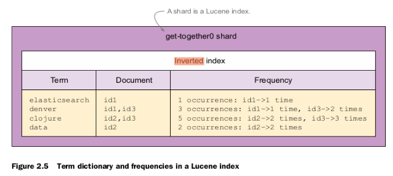
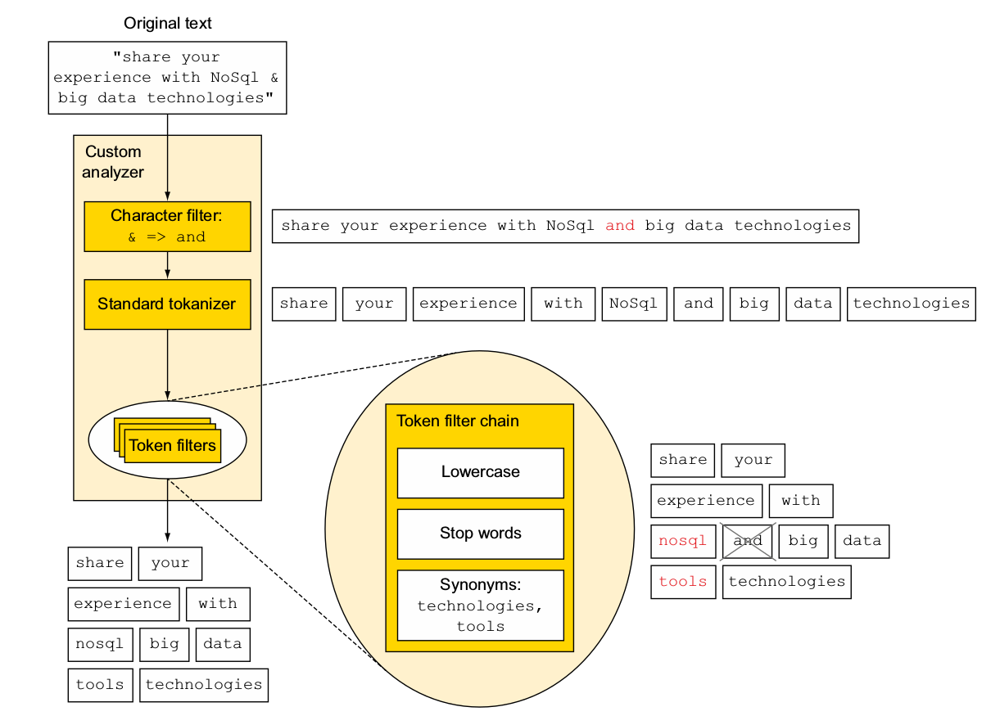

# elasticsearch

## 1 Giới thiệu

- Là một open-source search engine được xây dựng dựa trên apache lucene (một thư viện mã nguồn mở để xây dựng các search engine), nói cách khác lucene giống như ruby còn es là rails

- ES hoạt động độc lập như một server và giao tiếp thông qua giao thức resful

- ES là một hệ phân tán \*

2 Các khái niệm cơ bản

- Document: là một JSON object, là đơn vị nhỏ nhất để lưu trữ dữ liệu của ES

- Shard: gồm primary shard và replica shard, các document sẽ được lưu trong primary shard và được duplicate trong replica shard cho mục đích khôi phục trong trường hợp có 2 node trở lên

- Index: khi dữ liệu được gửi lên ES thì nó sẽ được đánh index trước khi được lưu vào shard, dữ liệu được đánh index dựa theo một cấu trúc là inverted index, ở SQL là Btree, dữ liệu sẽ được tách ra thành các từ gọi là term

## 2 Analysis data

Gồm bốn bước:

**Character filtering**: Chuyển đổi các ký tự sử dụng character filter
**Breaking text into tokens**: Tách đoạn text thành tập hợp các token
**Token filtering**: Biến đổi các token sử dụng token filter
**Token indexing**: Và cuối cùng là lưu các token đó vào inverted index



Ví dụ: Sơ đồ phân tích đoạn text "share your experience with NoSql & big data technologies"



### 2.1 Character filtering

Đây là bước đầu tiên của quá trình analysis, ở bước này, các ký tự sẽ được chuyển đổi thành dữ liệu cho phù hợp với yêu cầu search của bạn sử dụng các Character filters , quá trình nãy sẽ giúp bạn xử lý cho các trường hợp như muốn loại bỏ các thẻ/ký tự của HTML trong đoạn text, chuyển các ký tự thành từ có nghĩa như “I love u 2” thành “I love you too”. Ở ví dụ trên charater filter đã chuyển đổi ký tự "&" thành từ "and", vì vậy khi bạn tìm kiếm với từ khóa "and" thì dữ liệu chứa ký tự "&" sẽ được liệt kê ra

### 2.2 Breaking into tokens

Sau khi đoạn text đã được xử lý chuyển đổi các ký tự xong, nó sẽ được phân tách thành các tokens độc lập sử dụng các tokenizers. Elasitcsearch cung cấp rất nhiều tokenizers để phục vụ cho yêu cầu bài toán của bạn, ví dụ như whitespace tokenizer sẽ tách đoạn text thành các tokens dựa váo các khoảng trắng whitespace: "artic region" sẽ output ra 2 token artic, region, hoặc letter tokenizer sẽ tách đoạn text thành các token dựa vào whitespace và các ký tự đặc biệt: "sun-asterisk company" sẽ có output là 3 tokens sun, asterisk, company

### 2.3 Token filtering

Sau khi đoạn text được tách và cho ra output là các tokens, các tokens này sau đó sẽ được đưa vào một hoặc nhiều các Token filters, tại đây các tokens sẽ được xóa bợt, thêm hoặc chỉnh sửa tùy vào loại token filter. Các token này sẽ hữu ích trong trường hợp bạn muốn chuyển các token về dạng lowercase và ngược lại, hoặc có thể thêm token mới "tools" như ở ví dụ trên. Một analyzer có thể có không hoặc nhiều token filters

### 2.4 Token indexing

Sau khi các token đã đi qua 0 hoặc nhiều token filters chúng đã được gửi tới Lucene để được lập đánh index. Một analyzer sẽ bao gồm không hoặc nhiều character filters, một tokenizer, và không hoặc nhiều token filters

_Tạo một index_

```json
curl -X PUT "localhost:9200/my_index?pretty" -H 'Content-Type: application/json' -d'
{
    "settings" : {
        "index" : {
            "number_of_shards" : 1,
            "number_of_replicas" : 1
        }
    }
}
'
```

_Cấu trúc của một Analyzer_

```json
curl -X PUT "localhost:9200/my_index?pretty" -H 'Content-Type: application/json' -d'
{
  "settings": {
    "analysis": {
      "analyzer": {
        "my_custom_analyzer": {
          "type": "custom",
          "tokenizer": "whitespace",
          "char_filter": [
            "my_custom_char_filter"
          ],
          "filter": [
            "lowercase",
            "asciifolding"
          ]
        }
      },
      "char_filter": {
        "my_custom_char_filter": {
          "type": "mapping",
          "mappings": [
            "& => and"
          ]
        }
      }
    }
  },
  "mappings" : {
    ...
  }
}
'
curl -X POST "localhost:9200/my_index/_analyze?pretty" -H 'Content-Type: application/json' -d'
{
  "analyzer": "my_custom_analyzer",
  "text": "share <b>your</b> experience with NoSql & big data technologies"
}
'
```

_Custom các charfilter, tokenizer, token filter_

```json
curl -X PUT "localhost:9200/my_index?pretty" -H 'Content-Type: application/json' -d'
{
  "settings": {
    "analysis": {
      "analyzer": {
        "my_custom_analyzer": {
          "type": "custom",
          "char_filter": [
            "emoticons"
          ],
          "tokenizer": "punctuation",
          "filter": [
            "lowercase",
            "english_stop"
          ]
        }
      },
      "tokenizer": {
        "punctuation": {
          "type": "pattern",
          "pattern": "[ .,!?]"
        }
      },
      "char_filter": {
        "emoticons": {
          "type": "mapping",
          "mappings": [
            ":) => _happy_",
            ":( => _sad_"
          ]
        }
      },
      "filter": {
        "english_stop": {
          "type": "stop",
          "stopwords": "_english_"
        }
      }
    }
  }
}
'
curl -X POST "localhost:9200/my_index/_analyze?pretty" -H 'Content-Type: application/json' -d'
{
  "analyzer": "my_custom_analyzer",
  "text": "I\u0027m a :) person, and you?"
}
'
```

List tất cả các analyzer trong index

```json
curl -X GET "localhost:9200/my_index/_settings?pretty"
```

Update analyzer cho một index có sẵn

```json
curl -X POST "localhost:9200/my_index/_close?pretty"
curl -X PUT "localhost:9200/my_index/_settings?pretty" -H 'Content-Type: application/json' -d'
{
  "analysis" : {
    "analyzer":{
      "aaaa":{
        "type":"custom",
        "tokenizer":"whitespace"
      }
    }
  }
}
'
curl -X POST "localhost:9200/my_index/_open?pretty"
```

```json
curl -XPOST 'localhost:9200/my_index' -d '
{
  "mappings" : {
    "document" : {
      "properties" : {
        "field_name" : {
          "type" : "string",
          "analyzer" : "myCustomAnalyzer"
        }
      }
    }
  }
}
'
```

có 2 cách để thiết lập analyzer cho index, set global analyzer trong file elasticsearch.yml, set analyzer khi tạo một index (vd o tren có thể update analyzer)

### 2.5 Build in analyzer

#### 2.5.1 Standard

Đây là analyzer mặc định, sử dụng standard, lowercase, và stop token-filter, sẽ đề cập ở phần sau

#### 2.5.2 Simple

Simple analyzer tách đoạn text thành token khi gặp một ký tự không phải là letter. Nó bao gồm lowercase tokenizer

```
POST _analyze
{
  "analyzer": "simple",
  "text": "The 2 QUICK Brown-Foxes jumped over the lazy dog's bone."
}
```

kết quả:
[ the, quick, brown, foxes, jumped, over, the, lazy, dog, s, bone ]

#### 2.5.3 Whitespace

Tách đoạn text thành token dựa vào các whitespace. Nó bao gồm whitespace tokenizer

```
POST _analyze
{
  "analyzer": "whitespace",
  "text": "The 2 QUICK Brown-Foxes jumped over the lazy dog's bone."
}
```

Kết quả:
[ The, 2, QUICK, Brown-Foxes, jumped, over, the, lazy, dog's, bone. ]

#### 2.5.4 Stop

Giống với Simple analyzer, tách đoạn text thành token khi gặp một ký tự không phải là letter nhưng có thêm một tính năng là loại bỏ các token là stopword(a, an, the, sẽ đề cập ở phần sau) nhờ có thêm một token filter là Stop Token Filter

```
POST my_index/_analyze
{
  "analyzer": "my_stop_analyzer",
  "text": "The 2 QUICK Brown-Foxes jumped over the lazy dog's bone."
}
```

[ quick, brown, foxes, jumped, lazy, dog, s, bone ]

#### 2.5.5 Keyword

Lấy tất cả đoạn text thành một token. Khuyến khích set field thành not_analyzed thay vì dùng analyzer keyword

```json
curl -XPOST 'localhost:9200/my_index
{
  "mappings" : {
    "document" : {
      "properties" : {
        "field_name" : {
          "type" : "string",
          "analyzer" : "keyword"
        }
      }
    }
  }
}
'
```

Khuyến khích

```json
curl -XPOST 'localhost:9200/my_index
{
  "mappings" : {
    "document" : {
      "properties" : {
        "field_name" : {
          "type" : "string",
          "index": "not_analyzed"
        }
      }
    }
  }
}
'
```

#### 2.5.5 Pattern

Tách đoạn text thành token dựa vào biểu thức chính quy (RegEx), pattern mặc định là \W+: ngoại trừ tất cả non-word characters

POST \_analyze
{
"analyzer": "pattern",
"text": "The 2 QUICK Brown-Foxes jumped over the lazy dog's bone."
}

kết quả:
[ the, 2, quick, brown, foxes, jumped, over, the, lazy, dog, s, bone ]

#### 2.5.6 Language analyzer

Tập hợp các analyzer dành cho các ngôn ngữ khác nhau (arabic, armenian, basque, bengali, brazilian, bulgarian, catalan, cjk, czech, danish, dutch, english, finnish, french, galician, german, greek, hindi, hungarian, indonesian, irish, italian, latvian, lithuanian, norwegian, persian, portuguese, romanian, russian, sorani, spanish, swedish, turkish, thai). 

# cấu hình cho các analyzer

### 3 Tokenizer
Có 3 nhóm tokenizer:

#### Nhóm Các tokenizer hướng về xử lý text hướng từ ngữ (word oriented tokenizers)
Tách các đoạn text dài thành các từ riêng lẻ
#### 3.1 Standard tokenizer
Đây là tokenizer mặc định, sự dụng thuật toán tách từ của UAX 29 nên nó có thể áp dụng được cho hầu hết các ngôn ngữ thuộc châu âu.

```
POST _analyze
{
  "tokenizer": "standard",
  "text": "The 2 QUICK Brown-Foxes jumped over the lazy dog's bone."
}
```

Kết quả 
[ The, 2, QUICK, Brown, Foxes, jumped, over, the, lazy, dog's, bone ]

Các options
- max_token_length: độ dài cho phép của 1 token, mặc định là 255

```
PUT my_index
{
  "settings": {
    "analysis": {
      "analyzer": {
        "my_analyzer": {
          "tokenizer": "my_tokenizer"
        }
      },
      "tokenizer": {
        "my_tokenizer": {
          "type": "standard",
          "max_token_length": 5
        }
      }
    }
  }
}
```

#### 3.2 Keyword tokenizer
Cho ra cả đoạn text input thành một term, dùng để kết hợp với tokenizer để chuẩn hóa dữ liệu đầu ra, thường dùng cho search like

ví dụ

POST _analyze
{
  "tokenizer": "keyword",
  "text": "New York"
}

Kết quả 
[ New York ]

Các options
- max_token_length: độ dài cho phép của 1 token, mặc định là 255

```
PUT my_index
{
  "settings": {
    "analysis": {
      "analyzer": {
        "my_analyzer": {
          "tokenizer": "my_tokenizer"
        }
      },
      "tokenizer": {
        "my_tokenizer": {
          "type": "keyword",
          "buffer_size": 200
        }
      }
    }
  }
}
```

#### 3.3 Letter tokenizer
Tách đoạn text thành token bất cứ khi nào gặp phải một ký tự không phải letter

POST _analyze
{
  "tokenizer": "letter",
  "text": "The 2 QUICK Brown-Foxes jumped over the lazy dog's bone."
}

Kết quả
[ The, QUICK, Brown, Foxes, jumped, over, the, lazy, dog, s, bone ]

#### 3.4 Lowercase tokenizer
Giống với Letter tokenizer tách đoạn text thành token bất cứ khi nào gặp phải một ký tự không phải letter, nhưng đồng thời cũng lowercase các token tách được

POST _analyze
{
  "tokenizer": "lowercase",
  "text": "The 2 QUICK Brown-Foxes jumped over the lazy dog's bone."
}

Kết quả:
[ the, quick, brown, foxes, jumped, over, the, lazy, dog, s, bone ]

#### 3.5 Whitespace tokenizer
Giống với Letter tokenizer tách đoạn text thành token bất cứ khi nào gặp phải một ký tự whitespace
Các options
- max_token_length: độ dài cho phép của 1 token, mặc định là 255

#### Nhóm về xứ lý text hướng cấu trúc (structured text tokenizers)
Tách đoạn text thành các đoạn text nhỏ hơn theo các cấu trúc text khác như email, file path
#### 3.6 UAX URL email tokenizer
Giống với standard tokenizer ngoại trừ nó có thể nhận ra và lưu url và email thành một token

POST _analyze
{
  "tokenizer": "uax_url_email",
  "text": "Email me at john.smith@global-international.com or visit https://john-smith.com"
}

kết quả
[ Email, me, at, john.smith@global-international.com , or , visit, https://john-smith.com]

Các options
- max_token_length: độ dài cho phép của 1 token, mặc định là 255

#### 3.7 Path hierarchy tokenizer
Dùng để xử lý các đường dẫn thư mục, file. Tách đoạn text thành các đường dẫn thư mục theo hướng từ thư mục cha vào

POST _analyze
{
  "tokenizer": "path_hierarchy",
  "text": "/usr/local/var/log/elasticsearch.log"
}

kết quả
[/usr, /usr/local, /usr/local/var, /usr/local/var/log, /usr/local/var/log/elasticsearch.log]

Các options:
- delimiter : định nghĩa path separator, mặc định là '/' 
- replacement : thay thế delimiter trong token đầu ra 
- buffer_size : mặc định 1024
- reverse : tách từ theo hướng từ con -> cha, mặc định là false

#### Nhóm xử lý text hướng phân mảnh (partial word tokenizers)
Tách từ, các đoạn text thành các fragment nhỏ hơn.

#### 3.8 N-gram tokenizer
Tách một chuỗi thành các chuỗi con (gram) đều nhau có độ dài là N, hữu dụng cho các ngôn ngũ không nối các từ dài bằng khoảng trắng như tiếng Đức

POST _analyze
{
  "tokenizer": "ngram",
  "text": "Quick Fox"
}
kết quả
[ Q, Qu, u, ui, i, ic, c, ck, k, "k ", " ", " F", F, Fo, o, ox, x ]

các options
- min_gram : độ dài nhỏ nhất của 1 gram, mặc định là 1
- max_gram : độ dài lớn nhất của 1 gram, mặc định là 2
- token_chars : các loại ký tự mà được dùng để tách gram gồm : letter (ký tự chữ), digit (chữ số),  whitespace (' ' hoặc '\n'), symbol

#### 3.9 Edge N-gram tokenizer
Giống N-gram nhưng chỉ cho ra các gram là bắt đầu của một từ

### 4 Token filter
Dùng để chuẩn hóa các token được sinh ra sau quá trình tokenizing để đưa vào index, dùng để custom một analyzer, có thể có 0 hoặc nhiều token filter trong một analyzer
#### 4.1 Standard token filter
Ở các phiên bản cũ thì nó trim chữ s sau các từ, còn bây giờ thì nó không làm gì cả, đứng cho đủ bộ

#### 4.2 Lowercase/Upper token filter 
Lowercase/uppercase các token

#### 4.3 Stopword token filter 
Loại bỏ các token là stopword, hỗ trọ nhiều ngôn ngữ khác nhau https://www.ranks.nl/stopwords

PUT /my_index
{
    "settings": {
        "analysis": {
            "filter": {
                "my_stop": {
                    "type":       "stop",
                    "stopwords":  "_language_"
                }
            }
        }
    }
}

#### 4.4 Stemming tokenizers
Các tokenizer dùng để chuyển đổi các token về từ gốc theo ngữ pháp, vd: “walks“, “walking“, “walked” có từ gốc là "walk", trong es có 3 thuật toán stemming tương ứng với 3 tokenizer : porter, snowball, kstem
